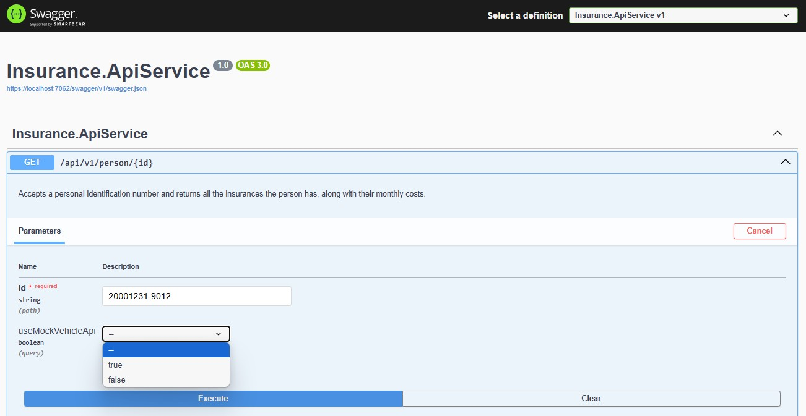
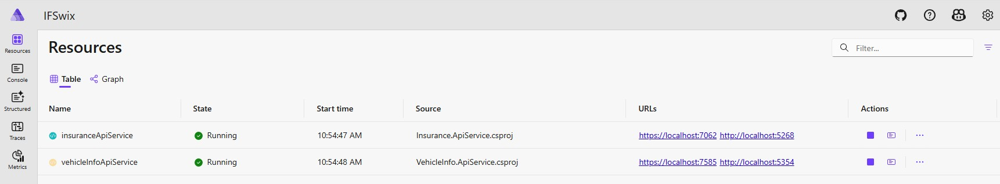
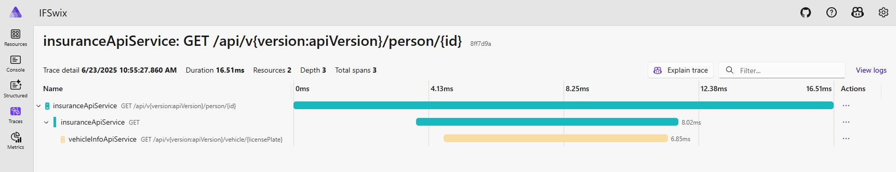

# IF Swix
**Explains your architecture and design decisions**

I decided to use Aspire to create two Minimal API apps. It felt like a really good fit, especially since the requirement was that endpoint1 calls endpoint2 and Aspire has really cool and powerful [tracing functionality that supports this out of the box](#aspiretraces). To easily test the tracing functionality of Aspire I decided to add a feature flag **useMockVehicleApi** to mock the call to endpoint2 as illustrated in this screenshot:



Since this is exposed as a query parameter the caller can explicitly set useMockVehicleApi, or, if left unset (-- in SwaggerUI), the system falls back to a feature flag set in Insurance.ApiService\appsettings.json (utilizing Microsoft.FeatureManagement).  
For the two minimal APIs I have used a folder based structure for the routes that simplifies API versioning.

**Describes how to run and test the solution locally**

To run the solution locally you need to start the orchestrating project **IFSwix.AppHost** - this will in turn start the other projects.
```
dotnet run --project IFSwix.AppHost
```
Then check the output for something like this:
```
Login to the dashboard at https://localhost:17197/login?t=<token>
```
This link will take you to the [Aspire dashboard](#aspiredashboard) where you can access the individual services among other things. If you press the URLs of one of the API services you are redirected to the SwaggerUI for that API. From SwaggerUI its simple to test both APIs, both have an endpoint that requires no input and returns all testdata, that way you can easily understand what input to use for the "real" methods of the API. 

**Discusses your approach to error handling, extensibility, and (if applicable) security**

Centralized error handling using UseExceptionHandler() to catch and log errors in a uniform way.
For extensibility, I leveraged polymorphism and inheritance in the data models (e.g., Insurance → CarInsurance). This allows us to support additional types without restructuring core logic. Aspire’s service discovery helped keep services decoupled and easily extendable. 
Not much effort has been put into security. If this is deployed in Azure you should protect the endpoints using API Management/VNET/Managed identity/OAuth or similar.


## At the end of your README, please include a short reflection (3–5 sentences) on:
**Q: Any similar project or experience you’ve had in the past.?**

**A:** Yes at Dustin I have been working on a middleware based on Azure Container Apps which sits between ERP and CRM. It uses Azure Cosmos DB for data and exposes/consumes multiple APIs, service bus queues/topics etc..
In the past I have also worked on similar projects at H&M, there we used Azure Functions to do REST calls, XML transformation and delivery of messages to legacy systems as part of the company's cloud journey.


**Q: What was challenging or interesting in this assignment.**

**A:** In May I atteded a Swenug session where Chris Klug talked about Aspire. Ever since I wanted to try it myself for real and this was a good opportunity to do just that. We have talked about introducing it at Dustin but never managed to get it prioritized so the Aspire part of this project has been both challenging and interesting! I decided to extend Insurance when I created CarInsurance, which introduced some complexity due to polymorphism when fetching data from the API.


**Q: What you would improve or extend if you had more time.**

**A:** Replace the hardcoded testdata in the models with an SQL db/Redis cache or similar to make it more realistic. Improve the OpenAPI spec by adding a more realistic example response and not just schema generated. It would also make sense to introduce Azure App Configuration for dynamic control of the feature flag (unless Microsoft decides to add support for this directly in the Aspire dashboard).


## Aspire sneak peak

Below is a screenshot of the Aspire dashboard that shows the two minimal API applications in this solution running locally:

<a name="aspiredashboard"></a>

Below is a screenshot that shows the traces from Aspire which spans across both APIs. This is because the trace shows a call to the insurance API with the input of a person who has a car insurance, hence the second call to the vehicle API to fetch vehicle info.

<a name="aspiretraces"></a>